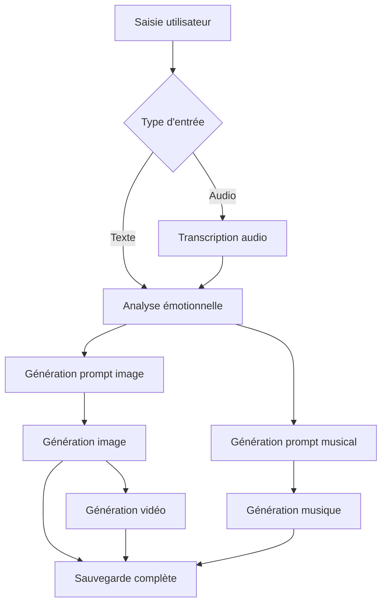

# 🌙 Synthétiseur de rêves

Application déployée sur : https://synthetiseurdereve.streamlit.app/

Une application innovante qui transforme vos rêves en créations artistiques multimédia grâce à l'intelligence artificielle. Racontez votre rêve en texte ou audio, et obtenez une image, une vidéo et une musique d'ambiance générées automatiquement.


## ✨ Fonctionnalités principales

### 🎤 Création de rêves
- **Saisie textuelle** : Tapez directement votre rêve
- **Upload audio** : Importez un fichier audio (WAV, MP3, M4A, OGG)
- **Transcription automatique** : Conversion audio vers texte avec Groq Whisper
- **Validation intelligente** : Vérification de la qualité du contenu

### 🧠 Analyse émotionnelle
- **Détection d'émotions** : 6 émotions principales analysées
- **Scores de 0 à 1** : Intensité précise de chaque émotion
- **Visualisation graphique** : Graphiques colorés et intuitifs
- **Tendances temporelles** : Évolution de vos émotions dans le temps

### 🎨 Génération multimédia
- **Images artistiques** : Création d'images oniriques et surréalistes
- **Vidéos animées** : Séquences courtes avec effets de parallaxe
- **Musique d'ambiance** : Compositions audio adaptées à l'atmosphère du rêve
- **Multiples fallbacks** : Plusieurs APIs pour garantir la génération

### 📚 Gestion et historique
- **Sauvegarde automatique** : Tous vos rêves sont conservés
- **Recherche avancée** : Filtrage par émotions, dates, mots-clés
- **Export/Import** : Sauvegarde et restauration de vos données
- **Statistiques détaillées** : Analyse de vos habitudes oniriques

## 🚀 Installation et configuration

### Prérequis
- Python 3.8 ou supérieur
- Compte sur les plateformes d'IA (optionnel pour certaines fonctionnalités)

### Installation

1. **Clonez le repository**
```bash
git clone https://github.com/BaoFrancisNguyen/synthetiseur_de_reve
'''

2. **Installez les dépendances**
```bash
pip install -r requirements.txt
```

3. **Configurez les APIs** (optionnel)
Créez le fichier `.streamlit/secrets.toml` :
```toml
# APIs pour l'analyse textuelle
GROQ_API_KEY = "votre_clé_groq"
MISTRAL_API_KEY = "votre_clé_mistral"

# APIs pour la génération d'images
CLIPDROP_API_KEY = "votre_clé_clipdrop"
HF_TOKEN = "votre_token_huggingface"
OPENAI_API_KEY = "votre_clé_openai"
REPLICATE_API_TOKEN = "votre_token_replicate"
RUNWARE_API_KEY = "votre_clé_runware"
STABLEDIFFUSION_API_KEY = "votre_clé_stablediffusion"
```

4. **Lancez l'application**
```bash
streamlit run app.py

aller sur localhost:8501
```

### APIs supportées

#### 🆓 Gratuites (recommandées)
- **Pollinations AI** : Génération d'images gratuite (aucune clé requise)
- **Prodia** : Images avec compte gratuit
- **Hugging Face** : Modèles open-source

#### 💰 Payantes (optionnelles)
- **Groq** : Transcription audio et génération de prompts
- **Mistral AI** : Analyse émotionnelle avancée
- **OpenAI DALL-E** : Images haute qualité
- **ClipDrop** : Génération d'images professionnelles
- **Replicate** : Modèles variés
- **Runware** : API rapide et fiable

## 📁 Architecture du projet

```
dream-synthesizer/
├── app.py                      # Application principale Streamlit
├── requirements.txt            # Dépendances Python
├── README.md                  # Documentation
├── .streamlit/
│   └── secrets.toml           # Configuration des APIs (à créer)
│   └── config.toml          
├── prompts/                   # Templates de prompts
│   ├── emotion_analysis.txt   # Prompt pour l'analyse émotionnelle
│   └── image_generation.txt   # Prompt pour la génération d'images
├── dream_videos/              # Vidéos générées (créé automatiquement)
├── dream_music/               # Musiques générées (créé automatiquement)
├── temp_images/               # Images temporaires
├── logs/                      # Fichiers de logs
└── dreams_data.json           # Base de données des rêves (créé automatiquement)
└── Testing/
    └──  app_test.py            # script de tests
```

## 🏗️ Architecture technique

### Classes principales

#### `PromptManager`
Gestionnaire centralisé des prompts d'IA avec :
- Chargement depuis fichiers externes
- Templates personnalisables
- Formatage dynamique des variables

#### `DreamSynthesizer`
Classe principale coordonnant :
- Transcription audio (Groq Whisper + Google Speech)
- Analyse émotionnelle (Mistral AI)
- Génération d'images (multiples APIs avec fallbacks)
- Génération de vidéos (Pollinations + effets locaux)
- Génération de musique (APIs + synthèse locale)
- Sauvegarde et chargement des données

### Flux de traitement




### Système de fallbacks

L'application utilise un système robuste de fallbacks pour garantir le fonctionnement même si certaines APIs sont indisponibles :

1. **Images** : Pollinations → Prodia → Runware → HuggingFace → ClipDrop → OpenAI → Replicate → Placeholder local
2. **Transcription** : Groq Whisper → Google Speech Recognition
3. **Musique** : Pollinations → Synthèse locale de tonalités ambiantes
4. **Vidéo** : Pollinations → Création locale avec effets de parallaxe

## 🎮 Guide d'utilisation

### 1. Créer un nouveau rêve

1. **Accédez à l'onglet "🎤 Nouveau rêve"**
2. **Choisissez votre méthode de saisie** :
   - Tapez directement votre rêve (minimum 20 caractères)
   - Uploadez un fichier audio et cliquez sur "Transcrire"
3. **Personnalisez les options** :
   - Cochez/décochez : Image, Vidéo, Musique
4. **Lancez la synthèse** avec le bouton "🎨 Synthétiser le rêve"
5. **Attendez la génération** (1-2 minutes)
6. **Téléchargez vos créations** avec les boutons de téléchargement

### 2. Explorer l'historique

1. **Accédez à "Historique"**
2. **Utilisez les filtres** :
   - Émotion dominante
   - Période temporelle
   - Recherche par mots-clés
3. **Cliquez sur un rêve** pour voir les détails
4. **Analysez les tendances** avec le bouton "Analyser les tendances émotionnelles"

### 3. Configuration

1. **Accédez à "Configuration"**
2. **Vérifiez l'état des APIs**
3. **Ajustez les paramètres** de génération
4. **Gérez vos données** (export/import)

## 🔧 Personnalisation

### Modifier les prompts

Les prompts sont stockés dans le dossier `prompts/` et peuvent être modifiés :

```python
# prompts/emotion_analysis.txt
Analyse les émotions dans ce rêve et retourne uniquement un JSON...

# prompts/image_generation.txt
Tu es un expert en génération de prompts pour des images oniriques...
```

### Ajouter de nouvelles émotions

Modifiez le dictionnaire dans `analyze_emotion()` :

```python
default_emotions = {
    "heureux": 0.3,
    "stressant": 0.2,
    "neutre": 0.4,
    "votre_nouvelle_emotion": 0.0,
    # ...
}
```

### Ajouter de nouvelles APIs

Implémentez une nouvelle méthode dans `DreamSynthesizer` :

```python
def _generate_nouvelle_api(self, prompt: str) -> Optional[Image.Image]:
    # Votre implémentation
    pass
```

Et ajoutez-la à la liste des méthodes dans `generate_image()`.

## 📊 Métriques et monitoring

### Logs
- Tous les événements sont loggés dans `logs/`
- Niveaux : DEBUG, INFO, WARNING, ERROR
- Rotation automatique des fichiers

### Métriques disponibles
- Nombre total de rêves
- Taux de succès des générations
- Émotions les plus fréquentes
- Utilisation des APIs
- Temps de traitement moyen

## 🐛 Dépannage

### Problèmes courants

#### "Erreur d'initialisation"
- Vérifiez que toutes les dépendances sont installées
- Vérifiez le format du fichier `secrets.toml`

#### "Impossible de générer une image"
- Au moins Pollinations (gratuit) devrait fonctionner
- Vérifiez votre connexion internet
- Consultez les logs pour plus de détails

#### "Transcription échouée"
- Vérifiez le format du fichier audio
- Essayez avec un fichier plus court
- Assurez-vous que l'audio contient de la parole

#### Performances lentes
- Réduisez la qualité des générations
- Utilisez moins d'APIs en parallèle
- Vérifiez votre connexion réseau

### Logs et debugging

```bash
# Activer le mode debug
export STREAMLIT_LOGGER_LEVEL=debug
streamlit run app.py

# Consulter les logs
tail -f logs/app.log
```

## 🔐 Sécurité et confidentialité

- **Clés API** : Stockées localement dans `secrets.toml`, jamais envoyées au repository
- **Données personnelles** : Vos rêves restent sur votre machine (fichier `dreams_data.json`)
- **Chiffrement** : Considérez chiffrer le fichier `dreams_data.json` pour plus de sécurité
- **APIs externes** : Vos prompts sont envoyés aux APIs pour génération

## 🤝 Contribution

### Comment contribuer

1. **Fork** le repository
2. **Créez une branche** : `git checkout -b feature/nouvelle-fonctionnalite`
3. **Committez** : `git commit -m "Ajout nouvelle fonctionnalité"`
4. **Push** : `git push origin feature/nouvelle-fonctionnalite`
5. **Créez une Pull Request**


## License

Ce projet est sous licence MIT. Voir le fichier `LICENSE` pour plus de détails.


## 📞 Support


-  **Contact** : bao.francis.nguyen@gmail.com

---

**Transformez vos rêves en art • Explorez votre inconscient • Créez des souvenirs visuels**